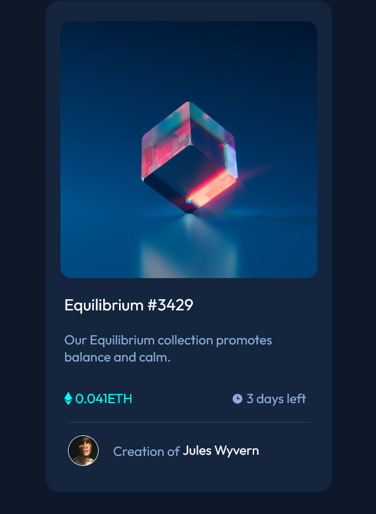

# Frontend Mentor - NFT preview card component solution

This is a solution to the [NFT preview card component challenge on Frontend Mentor](https://www.frontendmentor.io/challenges/nft-preview-card-component-SbdUL_w0U). Frontend Mentor challenges help you improve your coding skills by building realistic projects. 

## Table of contents

- [Overview](#overview)
  - [The challenge](#the-challenge)
  - [Screenshot](#screenshot)
  - [Links](#links)
- [My process](#my-process)
  - [Built with](#built-with)
  - [Continued development](#continued-development)  
- [Author](#author)

## Overview

### The challenge

Users should be able to:

- View the optimal layout depending on their device's screen size

### Screenshot

### Links

- Solution URL: [https://github.com/snellc1/NFT-Card](https://github.com/snellc1/NFT-Card)
- Live Site URL: [https://snellc1.github.io/NFT-Card/](https://snellc1.github.io/NFT-Card/)

## My process

### Built with

- Semantic HTML5 markup
- CSS custom properties
- Mobile-first workflow

### Continued development

Need to work on centering a image correctly and how to change an image background-color to show active. 

## Author

- Website - [Christopher Snell](https://github.com/snellc1/NFT-Card)
- Frontend Mentor - [@snellc1](https://www.frontendmentor.io/profile/yourusername)

